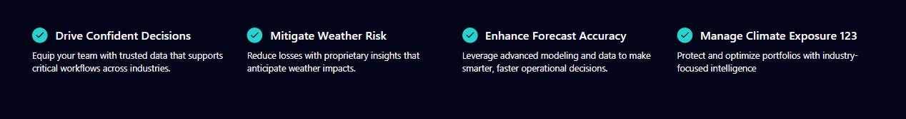
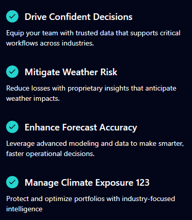
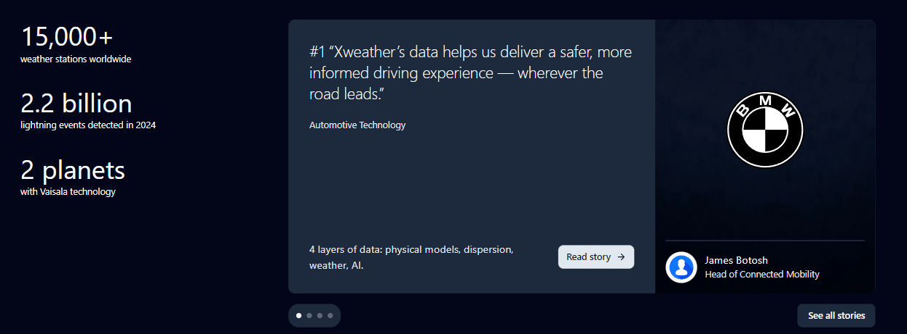
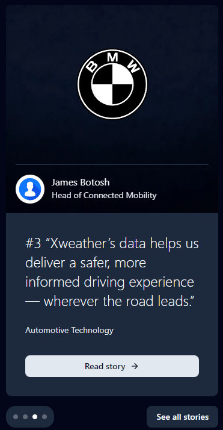
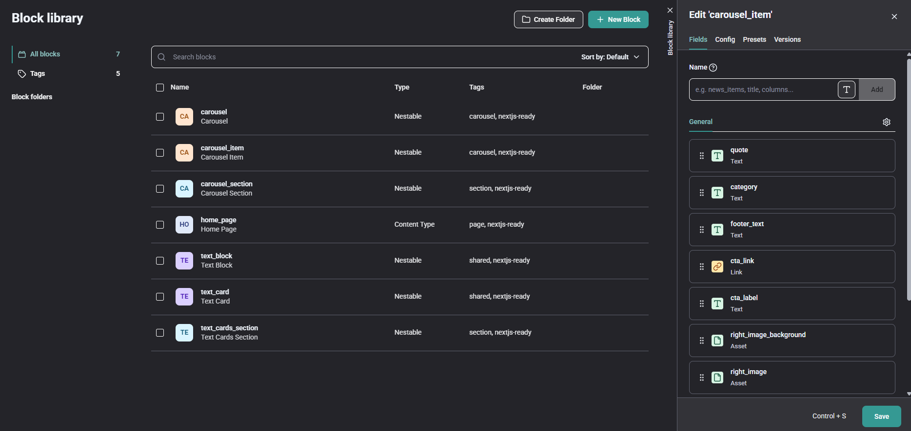
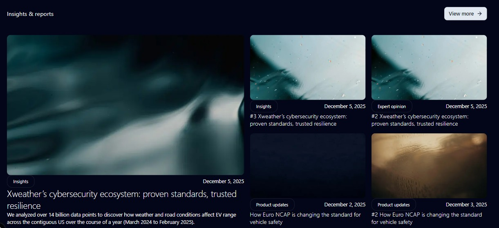
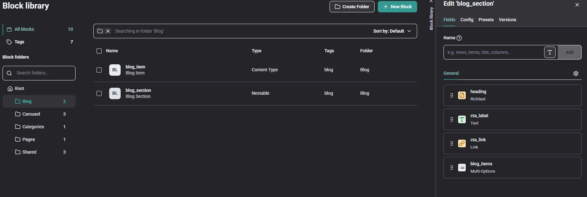

# xWeather onboarding tracker

### 📅 Monday, 01.12.2025

- 📞 Onboarding call with Denis, Eugene and Pavel; (14:30-15:00)
- Setup new Storyblok + Next.js project from scratch;
- Explore links from Eugene;

### 📅 Tuesday, 02.12.2025

- Predefine some dumb components to check connection;
- Fix "http:// is not allowed" error;
- Explore links from Eugene;
- Configure universal page for handling all Storyblok components;
- Configure Visual Editor Bridge (for live-reload and blocks highlight);
- Working with Storyblok for **mini-section**;
- Working with Next.js for **mini-section**;

 

### 📅 Wednesday, 03.12.2025

- Configure Storyblok CLI to fetch types and use them in code;
- Deploy project to Vercel (+configure new account);
- Configure Shadcn;
- Working with Storyblok for **slider section**;
- Working with Next.js for **slider section**;

 

### 📅 Thursday, 04.12.2025

- Self code-review and minor improvements;
- Prepare report for the first 3 days of onboarding;
- Explore Storyblok docs + learning mode with GPT-5;
- 📞 Reviewing my onboarding tasks and discussing the following; (14:00-15:10)
- Install and configure Cursor (+cloud profiles sync, +subscribtion, +GH profiles, +authorization);

### 📅 Friday, 05.12.2025

- Configure Self-signed certificate for `--experimental-https` flag;
- Try to configure Figma MCP in Cursor => MCP created and connected, but every request failed with Figma-side error;
- Working with Storyblok for **Insights & reports section** (trying to follow project style guide);
- 📞 Reviewing my onboarding tasks and discussing the following; (14:00-15:10)
- Setup fr-xweather repo via SSH (+save instructions for future sign-in);
- Fix Tailwind Intellisense issue in Cursor (problem with WSL/Cursor work);
- Working with Next.js for **Insights & reports section** (except rich text and single/multi-option fields render);

### 📅 Monday, 08.12.2025

- Working with Next.js for **Insights & reports section** (focus on rich text and correct content-type stories render);
  
  
- Read helpful links from Denis and Pavel;
- Install and configure Context7 in Cursor;
- Explore fr-xweather code;
- Explore fr-xweather Storyblok;
